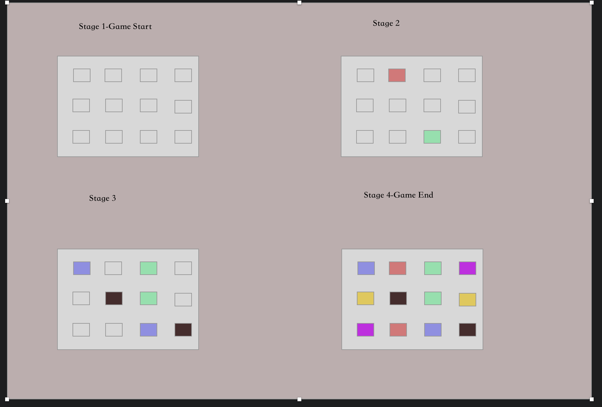

# MemoryGame

### Game Rules:

1. All tiles face down.
2. Turn over any two tiles.
3. If the two tiles match, you win.
4. If they don't match, turn them back over.
5. Remember what was on each tile and where it was.
6. Watch and remember during the other player's turn.
7. The game is over when all the tiles have been matched.
8. The player with the most matches wins.

## Schedule (Objectives/Goals)
### Wednesday

1. Wireframes
2. Pseudo Code

### Thursday

1. JS
2. Player Objects

### Friday

1. JS
2. boardGame fuction

### Saturday
1. JS, jQuery - added score display
2. HTML/CSS
### Sunday
1. Review and add/modify 

## References: 
1. https://www.youtube.com/watch?v=c_ohDPWmsM0
2. https://www.kirupa.com/html5/shuffling_array_js.htm
3. https://www.w3schools.com/
